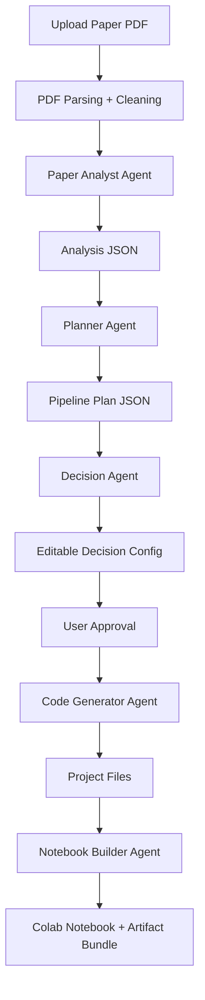

# Paper2Project

**Paper2Project** turns a machine learning research paper PDF into a structured, editable, reproducible starter project with **PyTorch code** and a **Google Colab notebook**.

The goal is not blind one-shot automation. The goal is a controllable system that helps you move from **paper -> pipeline -> decisions -> code -> notebook** with visibility at every step.

## What It Does

Given a research paper PDF, Paper2Project can:

1. Parse and clean the paper
2. Extract a structured ML understanding
3. Build an executable pipeline plan
4. Expose a human-editable decision layer
5. Generate modular project files
6. Generate a Colab notebook
7. Package the artifacts for download

Generated artifacts include:

- `model.py`
- `data_loader.py`
- `train.py`
- `config.yaml`
- `requirements.txt`
- `paper2project_notebook.ipynb`

## Why This Project Exists

Research papers are rarely implementation-ready. They often leave gaps around preprocessing, hyperparameters, dataset availability, evaluation details, or engineering structure.

Paper2Project is designed for the real engineering workflow:

- extract what the paper clearly says
- mark what is assumed
- let the user change important decisions
- generate a runnable baseline
- preserve enough structure to improve it later

## Core Design Principles

- Multi-agent instead of one giant LLM call
- JSON contracts between stages
- Human-in-the-loop before generation
- Reproducibility over “magic”
- Graceful degradation when inputs are messy
- Baseline code that runs and can be extended

## Architecture



## Agents

### Paper Analyst Agent

Extracts:

- task
- domain
- input/output format
- model family
- components
- loss
- metrics
- training details

### Planner Agent

Converts analysis into:

- execution steps
- dataset requirements
- model structure
- hyperparameters
- assumptions
- open questions

### Decision Agent

Exposes user-editable controls such as:

- dataset
- model
- optimizer
- scheduler
- loss
- epochs
- batch size
- learning rate
- seed

### Code Generator Agent

Builds a runnable baseline project from the approved config.

### Notebook Builder Agent

Builds a Colab notebook that reconstructs the generated files and runs training.

## Current Capabilities

### Parsing and enrichment

- PDF parsing with PyMuPDF
- Section chunking for downstream LLM calls
- Heuristic equation extraction
- Optional Grobid TEI ingestion
- Optional arXiv source download and LaTeX text enrichment

### LLM execution

- Multi-provider LLM client
- Shared agent memory across stages
- Configurable provider roster
- Configurable provider strategy:
  - `fallback_chain`
  - `first_success`
  - `ensemble`
- Retry and backoff support
- Heuristic fallback when LLM output is unavailable or invalid

### Workflow and backend

- FastAPI backend
- Background job execution with `ThreadPoolExecutor`
- Persistent JSON job store
- Artifact metadata and zip download endpoint
- API key protection
- CORS support

### Generation

- Config-driven training entrypoint
- Multi-domain baseline generation for:
  - NLP classification
  - NLP generation
  - CV classification
  - CV segmentation
  - tabular classification/regression
  - RL with a DQN baseline
- TensorBoard and optional W&B hooks

## Supported LLM Providers

The current provider layer supports:

- OpenAI
- Anthropic
- Google Gemini
- OpenRouter
- DeepSeek
- Groq
- Together
- xAI
- Ollama

Configuration is environment-driven with `P2P_`-prefixed settings, and `.env` loading is supported.

## Project Structure

```text
pro4/
|-- app/
|   |-- agents/
|   |-- api/
|   |-- core/
|   |-- models/
|   |-- orchestration/
|   |-- prompts/
|   `-- services/
|-- docs/
|-- examples/
|-- tests/
|-- pyproject.toml
`-- README.md
```

## Key Files

- [app/main.py](C:/Users/Antony%20Joseph/Documents/pro4/app/main.py)
- [app/orchestration/workflow.py](C:/Users/Antony%20Joseph/Documents/pro4/app/orchestration/workflow.py)
- [app/models/schemas.py](C:/Users/Antony%20Joseph/Documents/pro4/app/models/schemas.py)
- [app/services/llm_client.py](C:/Users/Antony%20Joseph/Documents/pro4/app/services/llm_client.py)
- [app/services/pdf_parser.py](C:/Users/Antony%20Joseph/Documents/pro4/app/services/pdf_parser.py)
- [app/services/code_generator.py](C:/Users/Antony%20Joseph/Documents/pro4/app/services/code_generator.py)
- [app/services/notebook_builder.py](C:/Users/Antony%20Joseph/Documents/pro4/app/services/notebook_builder.py)
- [tests](C:/Users/Antony%20Joseph/Documents/pro4/tests)

## API Overview

### `POST /jobs`

Upload a PDF and create a background job.

### `GET /jobs/{job_id}`

Fetch job state and outputs.

### `GET /jobs/{job_id}/decision`

Fetch the editable decision config.

### `PATCH /jobs/{job_id}/decision`

Update the decision config before generation.

### `POST /jobs/{job_id}/approve`

Start project and notebook generation.

### `GET /jobs/{job_id}/artifacts`

Fetch the artifact manifest.

### `GET /jobs/{job_id}/artifacts/download`

Download the generated zip bundle.

## Quick Start

```bash
python -m venv .venv
.venv\Scripts\activate
pip install -e .
uvicorn app.main:app --reload
```

Health check:

```bash
curl http://127.0.0.1:8000/health
```

## Environment Configuration

Examples:

```env
P2P_OPENAI_API_KEY=...
P2P_ANTHROPIC_API_KEY=...
P2P_GOOGLE_API_KEY=...
P2P_LLM_ROSTER=openai:gpt-4.1-mini,anthropic:claude-3-5-sonnet-latest,google:gemini-2.5-flash
P2P_LLM_STRATEGY=fallback_chain
P2P_REQUIRE_API_KEY=false
```

## Reproducibility Features

- fixed seed in generated configs
- explicit assumptions
- config-driven training
- modular output files
- editable decision layer
- artifact packaging
- notebook reconstruction from generated files

## Current Status

Paper2Project is now beyond a pure scaffold. The repository includes:

- provider-backed LLM orchestration
- persistence for job state
- background execution
- config-driven code generation
- notebook generation
- download endpoints
- authentication and CORS
- tests for core utilities

It is still a baseline-oriented system, not a perfect paper reproduction engine. That tradeoff is intentional.

## Tests

The repository includes a small but real test suite in [tests](C:/Users/Antony%20Joseph/Documents/pro4/tests) covering:

- job store persistence
- PDF parsing basics
- dataset mapper behavior
- generated config structure

## Contributors

Paper2Project is authored and directed by **Antony Joseph**.

AI-assisted contribution and development support:

- **OpenAI Codex**
- **Claude**

## Documentation

- [Architecture](C:/Users/Antony%20Joseph/Documents/pro4/docs/architecture.md)
- [Implementation Plan](C:/Users/Antony%20Joseph/Documents/pro4/docs/implementation-plan.md)
- [Example Parsed Paper](C:/Users/Antony%20Joseph/Documents/pro4/examples/parsed_paper.json)
- [Example Analysis](C:/Users/Antony%20Joseph/Documents/pro4/examples/analysis.json)
- [Example Pipeline Plan](C:/Users/Antony%20Joseph/Documents/pro4/examples/pipeline_plan.json)
- [Example Decision Config](C:/Users/Antony%20Joseph/Documents/pro4/examples/decision_config.json)

## Vision

The target workflow is straightforward:

**Upload a paper -> inspect the extracted pipeline -> edit decisions -> generate code -> run the notebook.**

That is the workflow this repository is built around.
