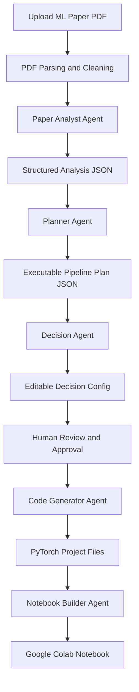

# Paper2Project

**Paper2Project** is an AI system that converts a **machine learning research paper PDF** into a **structured, reproducible, executable ML project** with **PyTorch code** and a **Google Colab notebook**.

If you are looking for a **research paper to code generator**, **ML paper reproduction tool**, **paper to PyTorch project pipeline**, or **paper to Colab notebook workflow**, this project is built for exactly that problem.

Paper2Project helps bridge the gap between:

- academic ML papers
- reproducible engineering baselines
- configurable experimentation
- runnable notebook-based demos

## Why Paper2Project Matters

Most research papers are not implementation-ready.

They are often missing:

- complete preprocessing details
- exact hyperparameters
- public datasets or clean dataset loaders
- edge-case handling
- production-oriented project structure

Most AI tools fail here because they try to solve the entire problem in one opaque LLM response.

Paper2Project takes the opposite approach:

- break the task into agents
- enforce structured JSON between stages
- expose assumptions to the user
- generate modular code instead of giant scripts
- optimize for a runnable baseline, not fake certainty

## What Paper2Project Does

Upload a machine learning paper PDF and the system will:

1. Parse the paper into structured sections
2. Extract the ML task, model, loss, metrics, and training hints
3. Build an executable ML pipeline plan
4. Ask the user to review key decisions
5. Generate modular PyTorch files
6. Generate a Google Colab notebook

### Output Artifacts

Paper2Project produces:

- `model.py`
- `data_loader.py`
- `train.py`
- `config.yaml`
- `paper2project_notebook.ipynb`

## Who This Is For

Paper2Project is useful for:

- ML engineers turning papers into baselines
- researchers validating ideas quickly
- students learning from research implementations
- founders building AI prototype pipelines
- teams creating reproducible paper-to-code workflows

## Core Product Positioning

Paper2Project is:

- a **multi-agent AI system**
- a **research paper to code pipeline**
- a **paper reproduction assistant**
- a **PyTorch project generator**
- a **Google Colab notebook generator**
- a **human-in-the-loop ML engineering workflow**

Paper2Project is not:

- a generic chatbot
- a one-shot summarizer
- fake pseudocode generation
- blind automation without user control

## Key Features

- Multi-agent architecture with explicit responsibilities
- JSON-based communication between every stage
- Human approval before code generation
- PyTorch-first implementation strategy
- Config-driven reproducibility
- Graceful handling of ambiguous or incomplete papers
- Colab-ready output
- Production-oriented backend design with FastAPI

## End-to-End Workflow



## Multi-Agent Architecture

Paper2Project is intentionally designed as a **modular AI agent system** rather than a single LLM call.

### 1. Paper Analyst Agent

Extracts:

- task type
- ML domain
- input and output format
- model family
- key components
- loss function
- metrics
- training details

### 2. Planner Agent

Builds:

- step-by-step ML pipeline
- dataset requirements
- model structure
- hyperparameters
- assumptions and open questions

### 3. Decision Agent

Exposes the editable control layer:

- dataset choice
- model substitution
- epochs
- batch size
- learning rate
- seed

### 4. Code Generator Agent

Generates:

- modular PyTorch code
- runnable training loop
- evaluation logic
- config-driven project structure

### 5. Notebook Builder Agent

Generates:

- Google Colab notebook
- install cells
- imports
- dataset setup
- model definition
- training and evaluation cells

## Why the Human-in-the-Loop Step Is Critical

Industry systems usually fail when they hide ambiguity.

Paper2Project exposes ambiguity before code generation because papers often leave open questions such as:

- which public dataset should replace the original dataset
- whether to prioritize faithfulness or Colab efficiency
- which backbone to use when the paper description is incomplete
- what default hyperparameters should be used

This makes the system more useful, more trustworthy, and much easier to improve.

## JSON-First Design

Every major stage returns structured JSON.

This is one of the most important engineering decisions in the project because it enables:

- validation
- retries
- observability
- human review
- auditability
- downstream code generation safety

### Example Analysis JSON

```json
{
  "task": "classification",
  "domain": "NLP",
  "input_data_type": "text",
  "output_format": "label",
  "model_type": "Transformer",
  "components": ["embedding", "self-attention", "feedforward"],
  "loss": "cross_entropy",
  "metrics": ["accuracy"],
  "training_details": {
    "optimizer": "adamw",
    "scheduler": "linear",
    "epochs": 3,
    "batch_size": 32,
    "learning_rate": 2e-5
  },
  "ambiguities": [],
  "assumptions": []
}
```

## Example Use Cases

### Research paper reproduction

Start from a paper PDF and get a baseline implementation that is actually runnable.

### AI project bootstrapping

Turn a paper into a starter codebase for fast experimentation.

### Educational workflows

Help students understand the path from paper methodology to real code.

### Internal R&D acceleration

Allow research and engineering teams to evaluate new papers faster.

## Tech Stack

Backend:

- FastAPI
- Pydantic
- Python 3.11+

Parsing:

- PyMuPDF
- optional Grobid integration

Artifact generation:

- nbformat
- PyYAML

ML stack:

- PyTorch
- Hugging Face `datasets`

LLM provider options:

- OpenAI GPT
- DeepSeek
- LLaMA-compatible endpoints

Future orchestration path:

- LangGraph

## Project Structure

```text
pro4/
|-- app/
|   |-- agents/
|   |-- api/
|   |-- core/
|   |-- models/
|   |-- orchestration/
|   |-- prompts/
|   `-- services/
|-- docs/
|-- examples/
|-- pyproject.toml
`-- README.md
```

## Repository Highlights

This repository already contains:

- FastAPI backend scaffold
- typed schemas for all agent outputs
- orchestration workflow
- prompt templates for each agent
- example JSON outputs
- notebook generation service
- code generation service
- architecture and implementation docs

Useful entry points:

- [app/main.py](C:/Users/Antony%20Joseph/Documents/pro4/app/main.py)
- [app/orchestration/workflow.py](C:/Users/Antony%20Joseph/Documents/pro4/app/orchestration/workflow.py)
- [app/models/schemas.py](C:/Users/Antony%20Joseph/Documents/pro4/app/models/schemas.py)
- [app/services/pdf_parser.py](C:/Users/Antony%20Joseph/Documents/pro4/app/services/pdf_parser.py)
- [docs/architecture.md](C:/Users/Antony%20Joseph/Documents/pro4/docs/architecture.md)
- [docs/implementation-plan.md](C:/Users/Antony%20Joseph/Documents/pro4/docs/implementation-plan.md)

## API Overview

### `POST /jobs`

Upload a paper PDF and start a new Paper2Project job.

### `GET /jobs/{job_id}`

Retrieve the full job state including parsed paper, analysis, plan, decision state, and artifacts.

### `GET /jobs/{job_id}/decision`

Fetch the editable decision JSON.

### `PATCH /jobs/{job_id}/decision`

Update dataset, model, epochs, batch size, learning rate, or seed.

### `POST /jobs/{job_id}/approve`

Approve the decision config and generate the project files plus notebook.

## Quick Start

```bash
python -m venv .venv
.venv\Scripts\activate
pip install -e .
uvicorn app.main:app --reload
```

Health check:

```bash
curl http://127.0.0.1:8000/health
```

## Reproducibility Features

- fixed random seed
- generated `config.yaml`
- explicit assumptions
- editable decision layer
- modular project structure
- Colab-friendly defaults
- clear separation between analysis, planning, and generation

## Failure Handling Strategy

Paper2Project is designed to degrade gracefully.

If a paper is incomplete or messy, the system should still produce a useful baseline.

Examples:

- missing methodology -> produce a simplified baseline
- unavailable dataset -> recommend substitutes
- ambiguous model -> ask for user confirmation
- unclear hyperparameters -> use conservative defaults

## SEO and Discoverability Keywords

This project is relevant to searches around:

- research paper to code
- machine learning paper implementation
- AI paper reproduction
- paper to PyTorch
- paper to project
- paper to notebook
- research paper to Google Colab
- LLM agent for ML engineering
- multi-agent research automation
- reproducible ML project generation

## Roadmap

1. Add real LLM provider adapters
2. Add persistent job storage
3. Add background workers
4. Add LaTeX and arXiv source ingestion
5. Add Grobid section extraction
6. Add execution validation for generated code
7. Add notebook smoke tests
8. Add downloadable artifact bundles
9. Add a UI for decision review

## Documentation

- [Architecture](C:/Users/Antony%20Joseph/Documents/pro4/docs/architecture.md)
- [Implementation Plan](C:/Users/Antony%20Joseph/Documents/pro4/docs/implementation-plan.md)
- [Example Parsed Paper](C:/Users/Antony%20Joseph/Documents/pro4/examples/parsed_paper.json)
- [Example Analysis](C:/Users/Antony%20Joseph/Documents/pro4/examples/analysis.json)
- [Example Pipeline Plan](C:/Users/Antony%20Joseph/Documents/pro4/examples/pipeline_plan.json)
- [Example Decision Config](C:/Users/Antony%20Joseph/Documents/pro4/examples/decision_config.json)

## Current Status

Paper2Project currently has a strong production-oriented foundation:

- architecture defined
- backend scaffold implemented
- agent contracts implemented
- prompt templates written
- code generator scaffold created
- notebook generator scaffold created

The next phase is operational hardening and live provider integration.

## Vision

The long-term goal of Paper2Project is simple:

**Upload a paper, inspect the extracted pipeline, edit key decisions, generate a runnable ML project, and execute the notebook successfully.**

That is the workflow ML engineers, researchers, and builders actually need.
